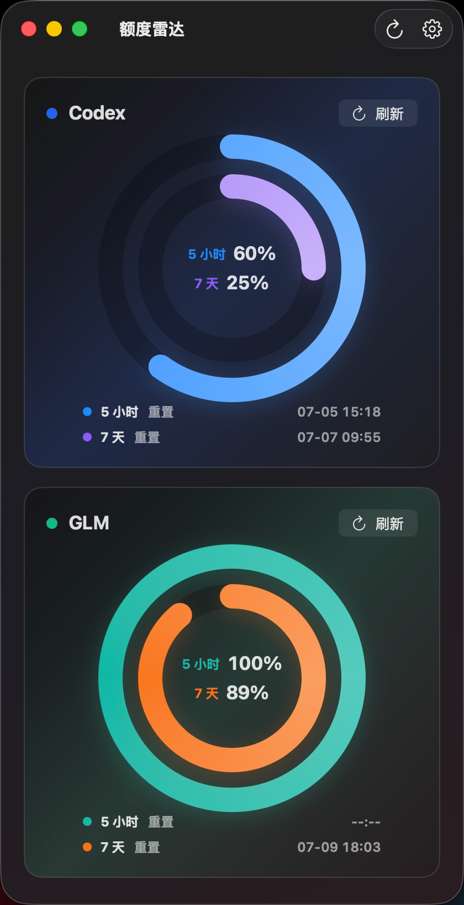

# 额度雷达 / Quota Radar

<p align="center">
  
</p>

<p align="center">
  
</p>

额度雷达是一个正常形态的 macOS SwiftUI App，用来在一个可调整大小的窗口里查看 Codex 和 GLM / ZAI coding plan 的额度、重置时间和本机 token 使用情况。

它不是桌面贴片，也不是隐藏 Dock 的菜单栏小工具：应用会显示在程序坞，有系统菜单栏，窗口左上角保留关闭、最小化和缩放按钮。

## 快速开始

构建：

```bash
swift build
```

测试：

```bash
swift test
```

构建并以 `.app` bundle 方式运行：

```bash
./script/build_and_run.sh
```

验证进程启动：

```bash
./script/build_and_run.sh --verify
```

构建本机安装 DMG：

```bash
./script/build_dmg.sh
```

生成物位于 `dist/QuotaRadar-<version>.dmg`。

构建 Developer ID 签名、公证并可用于 GitHub Release 的 DMG：

```bash
SIGN_IDENTITY="Developer ID Application: Your Name (TEAMID)" \
NOTARY_PROFILE="<notary-profile>" \
./script/build_signed_dmg.sh
```

生成物位于 `dist/QuotaRadar-<version>-signed.dmg`。

## 数据来源与网络边界

- Codex：默认读取本机 `~/.codex` token/session 数据，并尝试调用本机 Codex app-server 的额度接口。
- Codex 圆环：默认使用当前的 `7 天` 模式，外环显示剩余额度，内环按 `(重置时间 - 当前时间) / 7 天` 显示精确到小数点后 1 位的重置倒计时比例，并在圆环下方通过同色圆点标识倒计时行，显示剩余天、小时和分钟；可在 Codex 设置中切回兼容的 `5 小时 + 7 天` 双额度圆环，以便上游恢复 5 小时周期时直接启用。
- Codex 订阅到期：默认只使用本机 Codex app-server 和设置页手动规则。设置页可显式开启远程读取；开启后会使用本机 Codex access token 请求 `chatgpt.com` backend 来尝试读取订阅到期日。
- GLM / ZAI：内置参考 `glm-plan-usage` 的读取方式，使用 `ANTHROPIC_AUTH_TOKEN` 和 `ANTHROPIC_BASE_URL` 调用 quota API；设置页可手动补充。

应用不会上传本机 usage、线程或会话日志。涉及远程 API 的读取只发送对应服务要求的认证 header。

## 致谢

本项目实现过程中参考并感谢以下开源项目：

- [jukanntenn/glm-plan-usage](https://github.com/jukanntenn/glm-plan-usage)：GLM / ZAI quota API 读取方式和 premium 模型倍率规则参考。
- [shanggqm/codexU](https://github.com/shanggqm/codexU)：Codex 本机额度、token 使用统计和羊毛进度口径参考。

## 项目结构

```text
Sources/QuotaRadar/
├─ App/        # SwiftUI App 入口和正常 Dock App 激活
├─ Models/     # Provider 快照、卡片、额度窗口等数据模型
├─ Services/   # Codex / GLM 数据源和解析器
├─ Stores/     # 设置和刷新状态
├─ Support/    # 格式化、颜色、JSON 提取工具
└─ Views/      # 主窗口、Provider 面板、设置页
```
