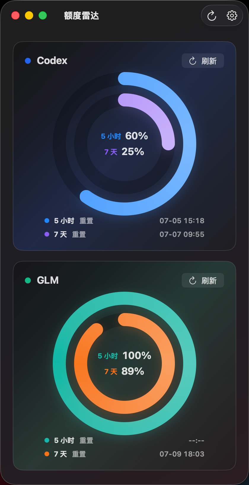

# 额度雷达 / Quota Radar

<p align="center">
  
</p>

<p align="center">
  
</p>

额度雷达是一个正常形态的 macOS SwiftUI App，用来在一个可调整大小的窗口里查看 Codex、GLM / ZAI coding plan 和 Claude Code 的额度与重置时间，并统计 Codex 本机 token 用量。

它不是桌面贴片，也不是隐藏 Dock 的菜单栏小工具：应用会显示在程序坞，有系统菜单栏，窗口左上角保留关闭、最小化和缩放按钮。

## 快速开始

构建：

```bash
swift build
```

测试：

```bash
swift test
```

构建并以 `.app` bundle 方式运行：

```bash
./script/build_and_run.sh
```

验证进程启动：

```bash
./script/build_and_run.sh --verify
```

构建本机安装 DMG：

```bash
./script/build_dmg.sh
```

生成物位于 `dist/QuotaRadar-<version>.dmg`。

构建 Developer ID 签名、公证并可用于 GitHub Release 的 DMG：

```bash
SIGN_IDENTITY="Developer ID Application: Your Name (TEAMID)" \
NOTARY_PROFILE="<notary-profile>" \
./script/build_signed_dmg.sh
```

生成物位于 `dist/QuotaRadar-<version>-signed.dmg`。

## 自定义圆环顺序

进入 **设置 → 通用 → 圆环显示与顺序**，在同一行勾选显示，并点击上下箭头调整 Codex、GLM、Claude Code 的顺序。顺序自动保存，同时作用于上下和左右布局；隐藏的服务保留位置，重新显示时回到原位。隐藏仅影响显示，不停止额度读取；排列方向在“布局”卡片中选择。

尚未取得额度时显示 `--`，不会误报为 0%；Codex 已有数据刷新时保留原值，并显示“更新中”。没有重置时间时，倒计时也显示 `--`。

纯圆环横排按实际内容高度收紧窗口，底部保留正常边距；切换排列或尺寸后重新适配。手动拖大窗口后，额度刷新会保留该尺寸。

## 数据来源与网络边界

- Codex：默认读取本机 `~/.codex` token/session 数据，并尝试调用本机 Codex app-server 的额度接口。
- Codex 圆环：默认使用当前的 `7 天` 模式，外环显示剩余额度，内环按 `(重置时间 - 当前时间) / 7 天` 显示精确到小数点后 1 位的重置倒计时比例，并在圆环下方通过同色圆点标识倒计时行，显示剩余天、小时和分钟；可在 Codex 设置中切回兼容的 `5 小时 + 7 天` 双额度圆环，以便上游恢复 5 小时周期时直接启用。
- Codex 订阅到期：默认只使用本机 Codex app-server 和设置页手动规则。设置页可显式开启远程读取；开启后会使用本机 Codex access token 请求 `chatgpt.com` backend 来尝试读取订阅到期日。
- Claude Code：设置可选择 CLI 或 Claude 桌面端。CLI 通过官方 `statusLine` 输入采集 5 小时和 7 天订阅额度，本地快照保存在 `~/Library/Caches/QuotaRadar/claude-code/`。CLI 不读取登录凭据、不额外请求额度接口；刷新只重读快照。桌面端方式读取本机 Claude Cookie 和 `Claude Safe Storage` 钥匙串，仅向 `claude.ai` 查询组织额度及账号标识，不将凭据写入配置、日志或额度缓存。
- GLM / ZAI：内置参考 `glm-plan-usage` 的读取方式，使用 `ANTHROPIC_AUTH_TOKEN` 和 `ANTHROPIC_BASE_URL` 调用 quota API；设置页可手动补充。

应用不会上传本机 usage、线程或会话日志。涉及远程 API 的读取只发送对应服务要求的认证 header。

## 接入 Claude Code 圆环

在 **设置 → Claude Code → 圆环额度来源** 选择 **CLI**（默认）或 **Claude 桌面端**；圆环只显示所选来源，不合并两边额度，也不在失败时自动换来源。

两种来源分别提供“启用 CLI 额度读取”和“启用桌面端额度读取”开关，默认开启并独立记忆。关闭所选来源后清空圆环，自动/手动刷新均不再读取该来源；重新开启后恢复读取。CLI 关闭读取仍保留采集器和会话绑定，若需停止终端采集并撤销配置，请使用“停用 CLI 采集”。桌面端关闭读取会取消进行中的查询并清除进程内额度缓存，保留来源选择。

Claude 设置与 Codex、GLM 一样先显示配色，再显示来源、读取开关和操作；详细说明可展开“读取说明”。暂停读取时主面板显示“已暂停读取”，并禁用该面板的刷新按钮。

### Claude 桌面端

先在本机 Claude 桌面端登录，然后选择“Claude 桌面端”。首次访问可能需要允许读取 `Claude Safe Storage` 钥匙串；不需要安装 CLI、配置状态栏或绑定对话。圆环状态行显示来源及接口返回的账号邮箱，不显示组织编号和更新时间。

每次刷新重新核对登录 Cookie；切换账号或组织后，手动刷新或等待自动刷新。数据跟随桌面端写入本地 Cookie 的状态，不能保证切号瞬间同步。检测到变化时清除旧缓存，拒绝旧请求结果；退出登录后不继续展示旧账号额度。切换回 CLI 不移除已有采集器。

桌面端请求至少间隔 60 秒，失败后退避 5 分钟；手动刷新也遵守间隔。只保存进程内的额度缓存，缺失/失效数据显示 `--`。读取器使用 SQLite 只读访问及 macOS 原生解密，无 Node/Python 依赖。仅支持已识别的 Chromium `v10` Cookie 格式；重复或缺失账号 Cookie 会明确报错，不猜测账号。依赖内部 Web 接口，Cloudflare 验证、登录过期或接口变化可能导致读取失败。

### CLI

1. 在使用 Claude Code 的 Mac 上打开额度雷达，进入 **设置 → Claude Code**。
2. 点击 **接入 / 更新采集器**。应用会备份 `~/.claude/settings.json` 并包装已有 `statusLine`，保留原命令的输入、输出和其他设置。原生采集器不依赖 Python 或 Node。
3. 在目标终端 Claude Code 会话中完成一次请求。仅当 Claude Code 提供 `rate_limits` 时才会显示额度；官方 Pro/Max 订阅支持这些窗口，API key、GLM 或其他服务不保证提供。
4. 外环显示 **5 小时剩余**，内环显示 **7 天剩余**，下方显示对应重置时间。缺失或已过重置时间的窗口显示 `--`。

采集器绑定首个提供有效额度的会话，防止不同账号的会话互相覆盖。切换会话或账号时，点击 **清除会话绑定**，再在目标会话中继续使用。多会话额度不会相加。数据超过 15 分钟未变化时标为“历史快照”；状态栏重复执行不代表服务器额度已更新，App 不保证 Claude Code 不活跃时的实时性。

**停用 CLI 采集** 会撤销采集接入、清除额度快照并恢复接入前的 `statusLine`，保留其后对其他设置的修改；若状态栏已被其他工具改写，会停止恢复并提示检查备份。备份位于 `~/.claude/settings.quota-radar-backup-*.json`，安装记录及独立采集器位于 `~/Library/Application Support/QuotaRadar/claude-code/`。不再使用时可在停用 CLI 采集后自行删除这些文件。备份可能包含原有私人配置，不应上传或提交到仓库。

若项目级 Claude 设置覆盖了用户级 `statusLine`，需让目标会话使用接入后的用户级命令；App 不会批量改写各项目设置。首次接入暂不显示 Claude 历史 token、费用或订阅到期卡片。

数据字段依据：[Claude Code status line 文档](https://code.claude.com/docs/en/statusline#rate-limit-usage)。

## 致谢

本项目实现过程中参考并感谢以下开源项目：

- [jukanntenn/glm-plan-usage](https://github.com/jukanntenn/glm-plan-usage)：GLM / ZAI quota API 读取方式和 premium 模型倍率规则参考。
- [shanggqm/codexU](https://github.com/shanggqm/codexU)：Codex 本机额度、token 使用统计和羊毛进度口径，以及 Claude Code 本地额度快照读取方式参考。

- [skibidiskib/claude-web-usage](https://github.com/skibidiskib/claude-web-usage)：Claude 桌面端 Cookie 数据源与额度接口参考。
- [steipete/CodexBar](https://github.com/steipete/CodexBar)：Claude Web 额度字段与账号接口参考。

## 项目结构

```text
Sources/QuotaRadar/
├─ App/        # SwiftUI App 入口和正常 Dock App 激活
├─ Models/     # Provider 快照、卡片、额度窗口等数据模型
├─ Services/   # Codex / GLM / Claude Code 数据源和解析器
├─ Stores/     # 设置和刷新状态
├─ Support/    # 格式化、颜色、JSON 提取工具
└─ Views/      # 主窗口、Provider 面板、设置页
```
